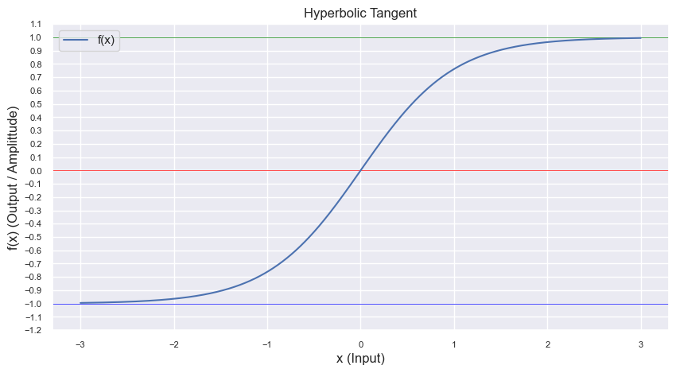

<h1 style="color: white; background: linear-gradient(43deg, #4158D0 0%, #d253c3 58%, #FB5959 100%); text-align: center; padding: 10px; box-shadow: 3px 3px 10px rgba(0,0,0,0.2); font-family: 'Segoe UI', Tahoma, Geneva, Verdana, sans-serif; border-radius: 5px; text-transform: capitalize;">
    Clipping Algorithms
</h1>

- `Clamp`: when a sample's value goes beyond a specified range (due to processing, amplification, or other effects), clamping restricts it to stay within this range.
  
$$f(x) = 
\begin{cases}
1.0 & \text{if } x > 1.0 \\
-1.0 & \text{if } x < -1.0 \\
x & \text{otherwise}
\end{cases}
$$

- `Soft Clipping`: (similar to Hyperbolic Tangent) Here we use a different approach. A common alternative is to use a polynomial or a sigmoid-like function. This function will provide a soft clipping effect that is different from the tanh function but still maintains the core characteristic of smoothly compressing the signal as it approaches and exceeds the threshold.

$$
f(x, \text{threshold}) = \text{threshold} \times \left( \frac{\frac{x}{\text{threshold}}}{1 + \left| \frac{x}{\text{threshold}} \right|} \right)
$$

- `Hard clipping`: abruptly cutting off the peaks of an audio signal that exceed a certain threshold. This results in a form of distortion where the tops of the waveform are effectively "clipped off." This type of clipping creates a harsh, distorted sound as it introduces high levels of harmonic distortion.

  The function here is combined with a soft knee to introduce a smoother transition around the threshold area.

  $$
  \text{hard\_clipping}(x, \theta, w) = 
  \begin{cases} 
  x & \text{if } |x| < \theta - \frac{w}{2} \\
  \text{sign}(x) \cdot \theta & \text{if } |x| > \theta + \frac{w}{2} \\
  \left( \frac{1}{1 + e^{-12 \left(\frac{|x| - (\theta - \frac{w}{2})}{w} - 0.5\right)}} \right) \cdot \text{sign}(x) \cdot \theta + \left( 1 - \frac{1}{1 + e^{-12 \left(\frac{|x| - (\theta - \frac{w}{2})}{w} - 0.5\right)}} \right) \cdot x & \text{otherwise}
  \end{cases}
  $$

- `Hyperbolic Tangent (tanh)`: It takes a value and returns a value between -1 and 1. For very small inputs, the output is approximately equal to the input, but as the input grows larger, the output gets squeezed towards 1 (or -1 for negative inputs). This function is often used in audio to achieve a kind of "soft clipping" or saturation effect.

  It creates an S-shaped curve (sigmoidal function) and is often used in situations where you want to map any range of input values to a standard range (-1 to 1), such as in neural network activation functions.

  Key difference with Normalize is that: Normalization scales values relative to each other to fit a certain range or magnitude, which is not necessarily between -1 and 1.

$$\tanh(x) = \frac{e^{2x} - 1}{e^{2x} + 1}$$

