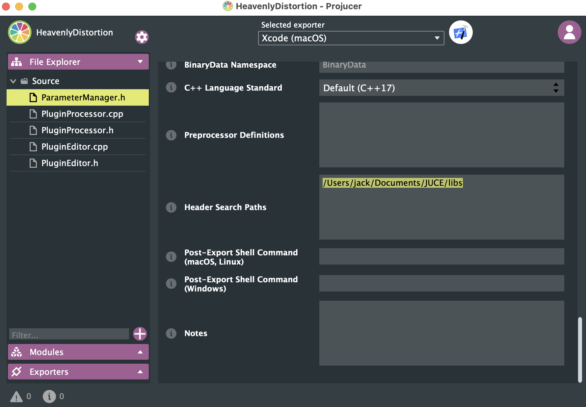

<h1 style="color: white; background: linear-gradient(43deg, #4158D0 0%, #d253c3 58%, #FB5959 100%); text-align: center; padding: 10px; box-shadow: 3px 3px 10px rgba(0,0,0,0.2); font-family: 'Segoe UI', Tahoma, Geneva, Verdana, sans-serif; border-radius: 5px; text-transform: capitalize;">
  Audio Libs
</h1>

This repository contains many C++ libraries designed by me. They are mostly for JUCE.

*If you are seeing this, you are likely reading the public repository. (Some functions will not be displayed)*

Click into folders to see detailed description.

### How to use it?
- Include the path of this module in Projucer

